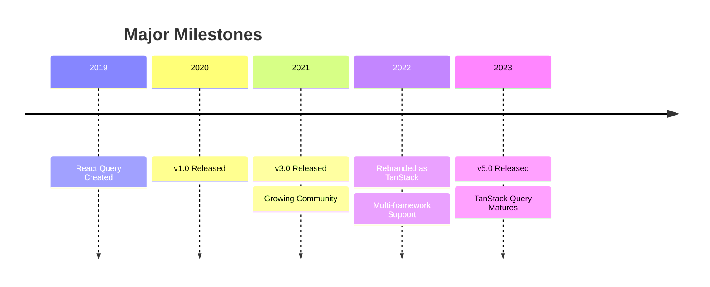
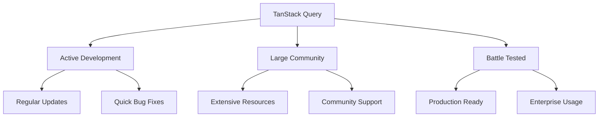

<h3 class="text-center">The Evolution of TanStack Query</h3>



---
layout: two-cols-header
---

### Framework Support

::left::

```ts {*}{maxHeight:'400px'}
// TypeScript/JavaScript
import { QueryClient } from '@tanstack/query-core'

// React
import { useQuery } from '@tanstack/react-query'

// Vue
import { useQuery } from '@tanstack/vue-query'

// Svelte
import { useQuery } from '@tanstack/svelte-query'

// Solid
import { useQuery } from '@tanstack/solid-query'

// Angular
import { injectQuery } from '@tanstack/angular-query'

// Same core API across all frameworks!
const query = useQuery({
  queryKey: ['data'],
  queryFn: fetchData
})

export class TodosComponent {
  todos$ = injectQuery(() => ({
    queryKey: ['todos'],
    queryFn: fetchTodos
  }))
}
```

::right::

<div class="mt-4 ml-8">
  <v-clicks>
    <div class="text-sm opacity-90">
      <div class="font-bold text-green-400">Universal Design:</div>
      <ul class="ml-4">
        <li>Consistent API across frameworks</li>
        <li>Shared core functionality</li>
        <li>Framework-specific optimizations</li>
        <li>Unified documentation</li>
      </ul>
    </div>
  </v-clicks>
</div>

---
layout: center
---

### Why TanStack Query?

<div class="relative h-[400px]">
  <div v-click-hide class="absolute inset-0 pt-12">

  </div>
  <div v-after class="absolute inset-0">
    <div class="flex justify-center items-center h-full">
      <div class="text-lg">
        <div class="text-3xl font-bold text-green-400 mb-6">Project Health</div>
        <ul class="space-y-4 text-xl">
          <li class="flex items-center">
            <span class="text-green-400 mr-3">⭐</span>
            42.5k+ GitHub stars
          </li>
          <li class="flex items-center">
            <span class="text-green-400 mr-3">📈</span>
            4.2M Weekly Downloads (React)
            <br />
            142K Weekly Downloads (Vue)
          </li>
          <li class="flex items-center">
            <span class="text-green-400 mr-3">🚀</span>
            Weekly releases
          </li>
          <li class="flex items-center">
            <span class="text-green-400 mr-3">👥</span>
            Active maintainer team
          </li>
          <li class="flex items-center">
            <span class="text-green-400 mr-3">🏢</span>
            Enterprise adoption
          </li>
        </ul>
      </div>
    </div>
  </div>
</div>
